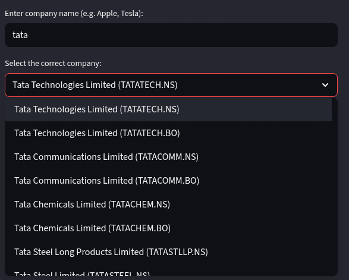
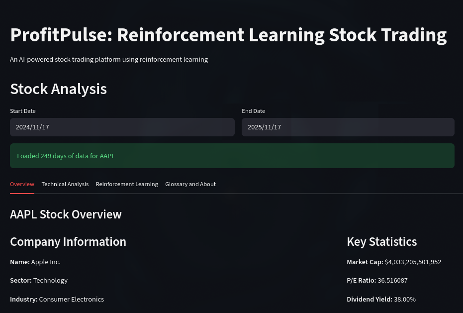
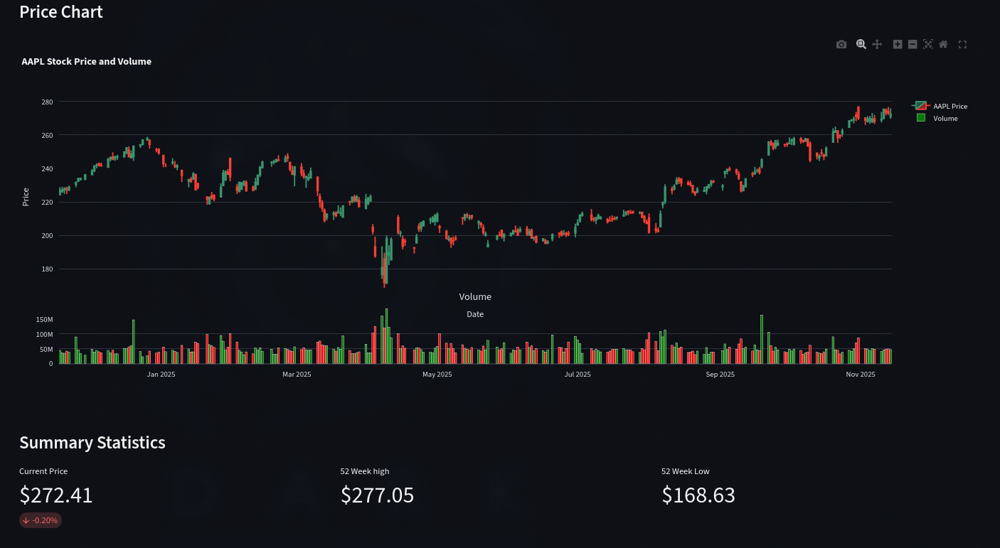
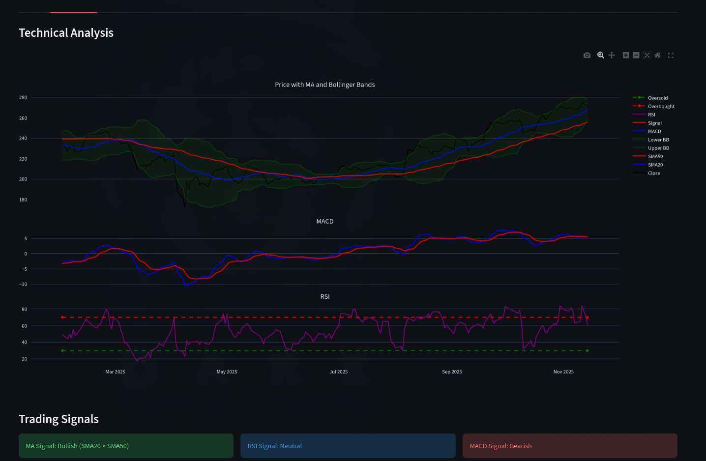
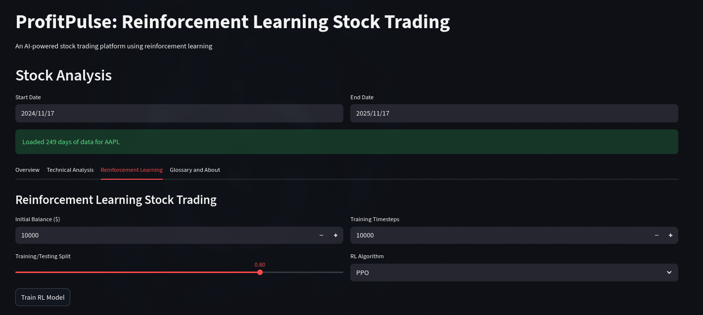
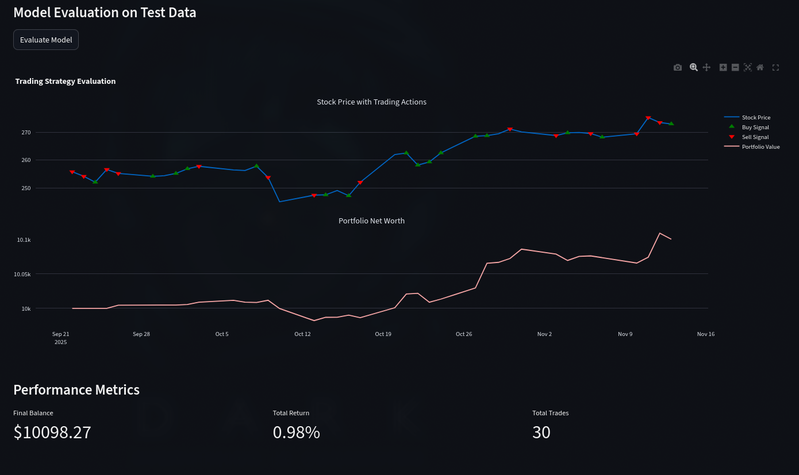

# 📈 ProfitPulse: Reinforcement Learning Stock Trading

ProfitPulse is an AI-powered stock trading platform built with Streamlit. It allows users to analyze historical stock data, visualize technical indicators, and train Reinforcement Learning (RL) agents to simulate and evaluate trading strategies.

The application fetches real-time data, processes it to find trading signals, and uses stable_baselines3 to train models (PPO, A2C, DQN) on a custom gymnasium environment.

## 🌟 Key Features

- **Stock Search**: Search for stocks by company name using the Financial Modeling Prep API.
- **Company Overview**: View key company information and statistics (like P/E Ratio and Market Cap) from yfinance.
- **Interactive Price Charts**: Visualize stock performance with Plotly-based candlestick and volume charts.
- **Technical Analysis**: Automatically calculates and displays key indicators:
  - Simple Moving Averages (SMA20, SMA50)
  - Bollinger Bands
  - Moving Average Convergence Divergence (MACD)
  - Relative Strength Index (RSI)
- **Reinforcement Learning**:
  - Train one of three models (PPO, A2C, or DQN) on historical data.
  - Customize training parameters like initial balance, train/test split, and timesteps.
- **Strategy Backtesting**: Evaluate the trained RL agent on unseen test data.
- **Performance Visualization**: Plot the agent's "Buy" and "Sell" signals on the price chart and track the portfolio's net worth over time.
- **Educational Glossary**: Includes a tab explaining common financial terms.

🖼️ Screenshots

Here's a look at the application's interface.

<table>
<tr>
<td><strong>Stock Search</strong></td>
<td><strong>Company Overview</strong></td>
</tr>
<tr>
<td></td>
<td></td>
</tr>
<tr>
<td><strong>Price Chart</strong></td>
<td><strong>Technical Analysis</strong></td>
</tr>
<tr>
<td></td>
<td></td>
</tr>
<tr>
<td><strong>RL Training Setup</strong></td>
<td><strong>RL Evaluation Results</strong></td>
</tr>
<tr>
<td></td>
<td></td>
</tr>
</table>

## 🛠️ Technology Stack

- **Web Framework**: Streamlit
- **Data & ML**: Pandas, NumPy, stable-baselines3
- **RL Environment**: gymnasium
- **Data Sources**: yfinance, Financial Modeling Prep
- **Plotting**: Plotly, Matplotlib
- **Configuration**: python-dotenv

## 🚀 Getting Started

Follow these instructions to set up and run the project locally.

### 1. Prerequisites

- Python 3.8+
- An API Key from [Financial Modeling Prep](https://financialmodelingprep.com/) (used for stock symbol search)

### 2. Installation & Setup

**Clone the repository:**

```bash
git clone https://github.com/gsamansharma/stock-visualiser
cd stock-visualiser
```

**Create and activate a virtual environment:**

This project is configured to ignore an `env/` directory.

```bash
python -m venv env
source env/bin/activate  # On Windows, use `env\Scripts\activate`
```

**Install dependencies:**

```bash
pip install -r requirements.txt
```

Based on `requirements.txt`.

**Create your environment file:**

Create a file named `.env` in the root directory. The `.gitignore` file is set to ignore this file. Add your API key from Financial Modeling Prep:

```ini
FMP_API_KEY="YOUR_API_KEY_HERE"
```

### 3. Running the Application

Once your setup is complete, run the Streamlit app:

```bash
streamlit run app.py
```

Open your browser and navigate to the local URL (usually `http://localhost:8501`).

## 🖥️ How to Use

1. **Search for a Stock**: Use the sidebar to enter a company name (e.g., "Apple").
2. **Select the Stock**: Choose the correct stock from the search results.
3. **Analyze**:
   - **Overview Tab**: See company info and price charts.
   - **Technical Analysis Tab**: Review indicators and automated trading signals.
4. **Train the RL Model**:
   - Go to the Reinforcement Learning tab.
   - Set your desired Initial Balance, Training/Testing Split, Timesteps, and RL Algorithm (PPO, A2C, or DQN).
   - Click "Train RL Model".
5. **Evaluate the Model**:
   - After training is complete, click "Evaluate Model".
   - The app will run the trained agent on the test data and display the results, including a performance chart and final metrics.

## 🧑‍💻 Authors

This project was developed by:


- Deepanshu Jindal - [@DeepanshuJindal30](https://github.com/DeepanshuJindal30)
- Ankit Panigarhi - [@PanigrahiAnkit](https://github.com/PanigrahiAnkit)
- Aman Sharma - [@gsamansharma](https://github.com/gsamansharma)

## ⚠️ Disclaimer

This application is for educational purposes only and should not be considered financial advice. All trading simulations are based on historical data and do not guarantee future results.